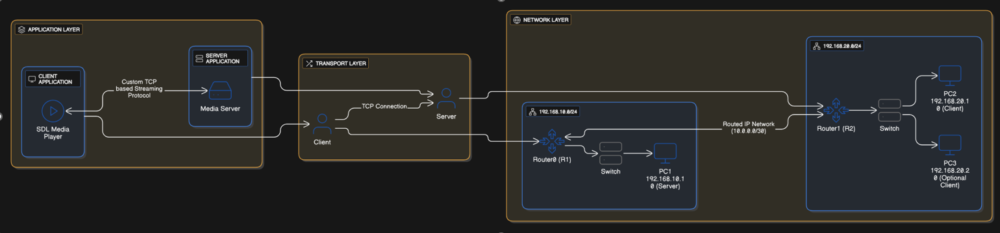
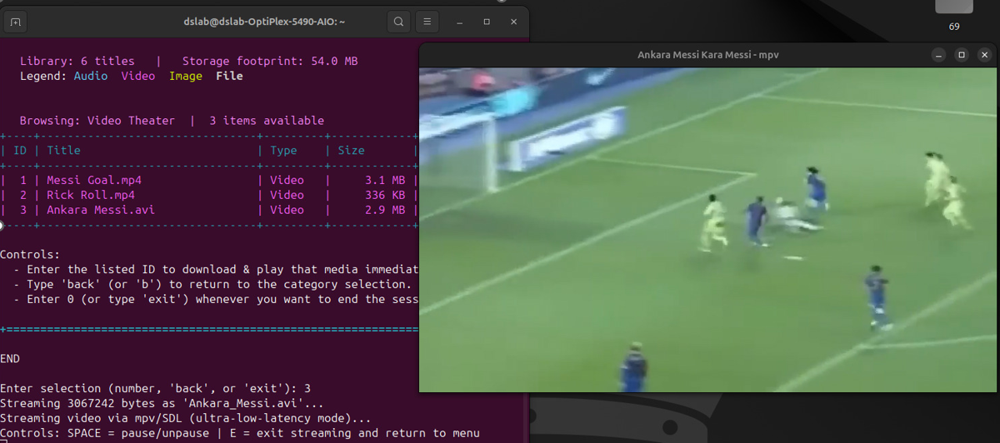
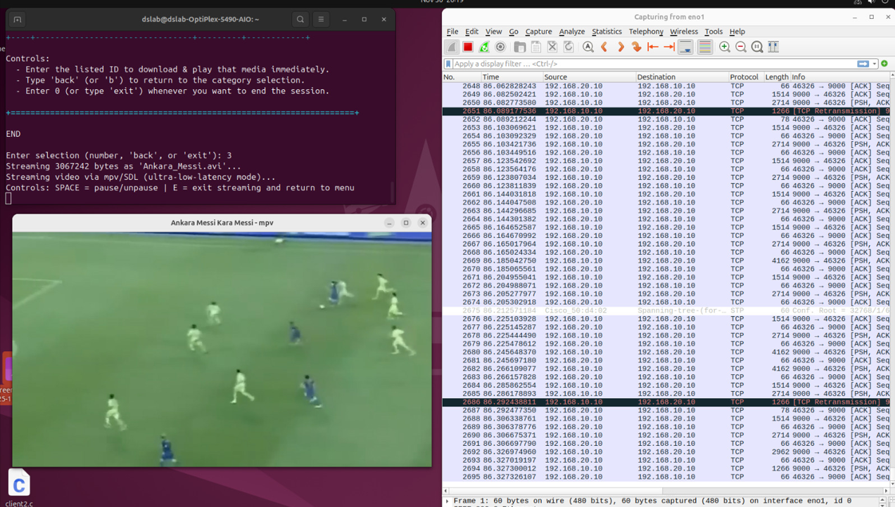

# TCP Multimedia Streaming System

Multithreaded multimedia streaming system implemented in C and deployed across a routed TCP/IP network environment.

<p align="center">
  
</p>

---

# Overview

This project implements a complete real-time multimedia streaming architecture using low-level socket programming, multithreaded client-server communication, SDL video playback, and FFmpeg-based audio streaming.

The system was deployed and validated across a routed Cisco network environment using static routing and Wireshark packet analysis. Instead of traditional file transfer, the system streams media continuously in real time using a custom TCP-based application-layer protocol.

---

# System Architecture

<p align="center">
  
</p>

The architecture is divided into three major layers:

- **Application Layer**  
  Handles media streaming, client interaction, SDL rendering, and FFmpeg playback.

- **Transport Layer**  
  Maintains persistent TCP connections for reliable byte-level streaming.

- **Network Layer**  
  Uses routed multi-subnet infrastructure with Cisco routers and static routing.

---

# Live Streaming Demonstration

<p align="center">
  
</p>

The client application supports:
- Real-time video streaming
- Real-time audio streaming
- Interactive media selection
- Stream interruption handling
- Persistent TCP communication

---

# Wireshark Validation

<p align="center">
  
</p>

Wireshark was used extensively to validate:
- TCP packet delivery
- Stream continuity
- Retransmissions
- Session termination
- Routed packet traversal across subnets

---

# Features

- Multithreaded TCP media server
- Real-time audio and video streaming
- Custom application-layer protocol
- Routed multi-subnet deployment
- SDL-based video playback
- FFmpeg/ffplay audio playback
- Wireshark traffic validation
- Graceful stream interruption handling
- Persistent client-server sessions
- Concurrent client support

---

# Network Infrastructure

## Topology

- 2 Cisco routers
- Multiple routed subnets
- Static IP addressing
- Point-to-point inter-router link
- Linux-based server and clients

## Routing

Static routing was configured manually to enable:
- End-to-end communication
- Multi-hop streaming
- Routed TCP traffic validation

---

# Source Code Structure

```text
src/
├── Media_server.c
├── Media_client.c
```

### Media_server.c
Responsible for:
- Multithreaded client handling
- Media streaming logic
- Session management
- TCP communication

### Media_client.c
Responsible for:
- Media selection interface
- Stream reception
- SDL rendering
- Audio playback using FFmpeg

---

# Technologies Used

## Systems & Networking

- C
- TCP/IP
- Socket Programming
- Multithreading
- Linux
- Cisco Routing

## Media & Analysis

- SDL
- FFmpeg
- ffplay
- Wireshark

---

# Results

| Metric | Result |
|---|---|
| Streaming Type | Real-time TCP streaming |
| Architecture | Multithreaded client-server |
| Network Environment | Routed multi-subnet topology |
| Media Support | Audio + Video |
| Validation Tools | Wireshark + Router CLI |
| Playback Engine | SDL + FFmpeg |

---

# Key Engineering Concepts

- Persistent TCP connections
- Application-layer protocol design
- Thread synchronization
- Real-time byte streaming
- Packet analysis
- Routed infrastructure deployment
- Network performance evaluation
- Concurrent client handling

---

# Future Work

- RTP/UDP streaming support
- Adaptive buffering
- Dynamic routing integration
- Stream compression optimization
- Multi-client scaling improvements
- Network congestion handling

---

# Documentation

- [Full Technical Report](docs/tcp_multimedia_streaming_report.pdf)

---

# Authors

Hasan Al Hussein  
Khalifa University
